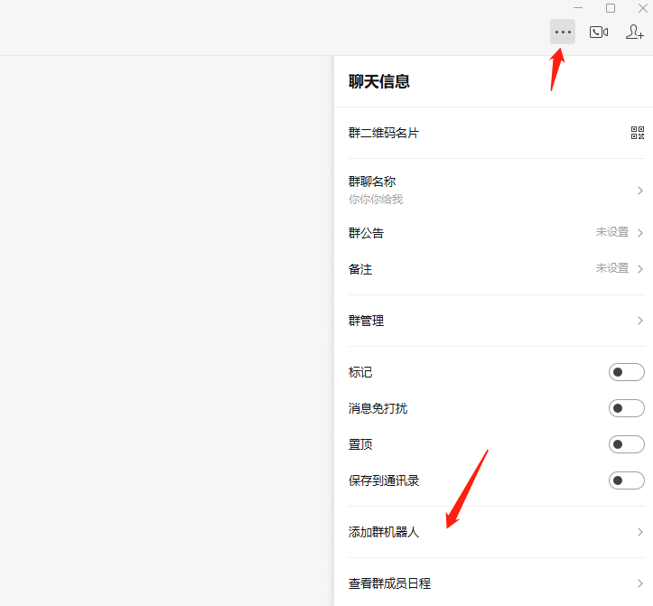
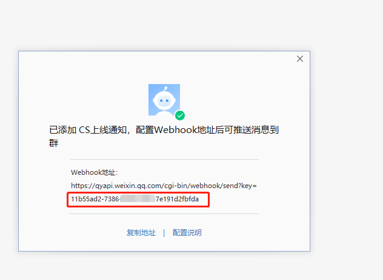
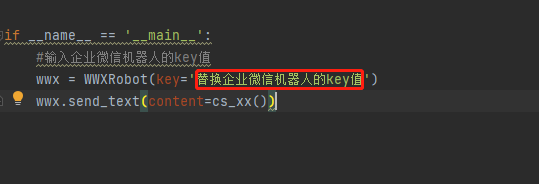
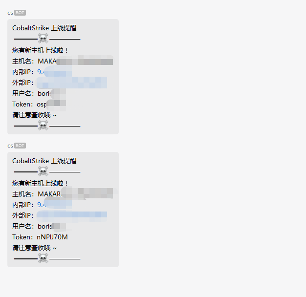

# CS_online_WX_reminder_K
### 简介
实现CS服务端上线通知---企业微信机器人   
### 声明
原项目作者：GitlXl   
项目地址：https://github.com/GitlXl/Cobalt_Strike_bot   
### 项目介绍
本项目是对GitlXl师傅的项目进行更改
#### 项目结构
CS_bot.cna   获取上线用户的相关信息,并传递给CS_bot.py   
CS_bot.py    将获取到的上线信息,传送给机器人
### 使用教程
#### 创建企业微信机器人

#### 获取机器人key值

#### 配置py脚本 
将获取到的机器人key填入   

#### 配置cna脚本
CS_bot.cna文件需修改的内容：图中选中改为CS_bot.py文件的绝对路径   

### 依赖
`pip install WorkWeixinRobot`
### 启动
在服务端使用CS自带的agscript工具启动,启动命令参数如下：   
`agscript <host> <port> <user> <pass> </file/CS_bot.cna>`
### 效果
